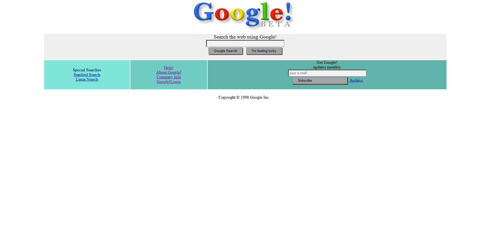

# Kodluyoruz  Repo

Bu repo [Kodluyoruz](https://www.kodluyoruz.org) Front-End Eğitiminde oluşturduğumuz repo. 
Bu proje, 1998'de Google'ın arama sayfasının görünümünü yeniden oluşturur. Basit bir arama formunu, özel aramalara ve Google ile ilgili bağlantılara sahiptir. Tasarım, o dönemin tipik tarzlarını içerir.

## Kullanılan Teknolojiler

- HTML
- CSS

## Özellikler

- 1998'den Google logosu.
- Farklı bir giriş kutusuyla basit bir arama formu.
- "Google'da Ara" ve "Şanslıyım" düğmeleri.
- Özel aramalar için bağlantılar (Stanford ve Linux).
- Navigasyon bağlantıları (Yardım, Google Hakkında, Şirket Bilgileri, Google Logoları).
- E-posta girişi ve "Abone Ol" düğmesi ile abonelik formu.
- Arşive bir bağlantı.



## Installation

Öncelikle projeyi clonelayın. (Buraya sizin reponuzdan aldığınız link gelecek)

```bash
git clone https://github.com/Yulduzb/CSS-dev-2.git
```

## Usage

Projeyi cloneladıktan sonra Visual Studio Code programında açınız.

Linux için:
```linux
cd kodluyoruzilkrepo
code .
```

## Contributing
Pull requestler kabul edilir. Büyük değişiklikler için, lütfen önce neyi değiştirmek istediğinizi tartışmak için bir konu açınız.


## License
[MIT](https://choosealicense.com/licenses/mit/)